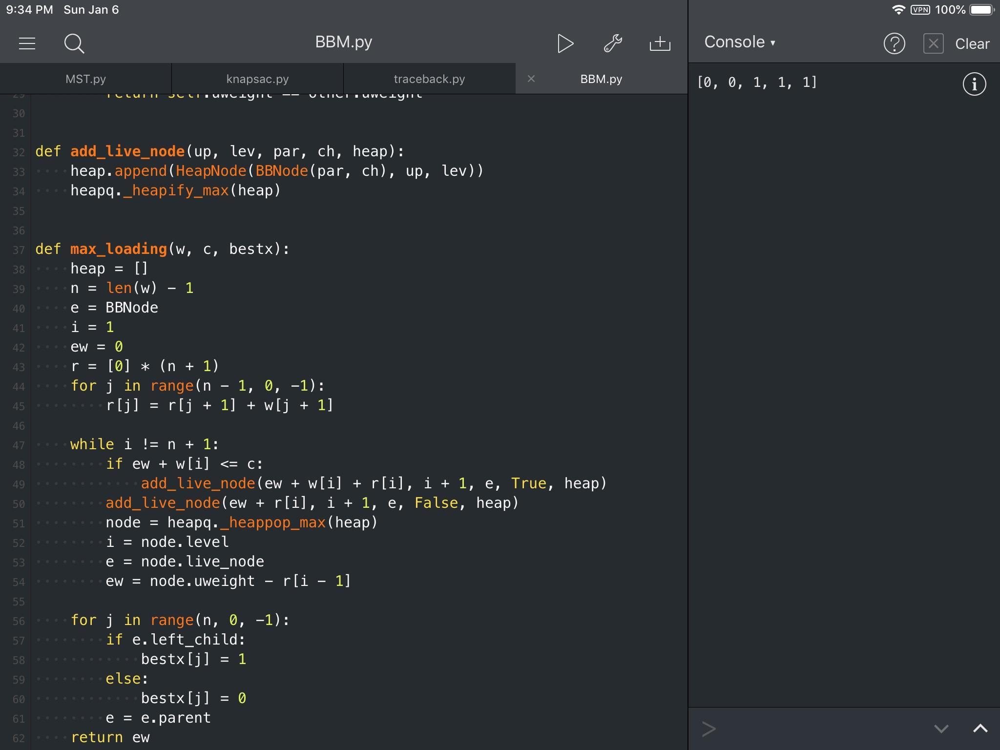

#  分支限界法

###  一、问题描述

装载问题
- 有一批共n个集装箱要装上两艘载重量分别为 $c_1$和  $ c_2$的轮船。其中，集装箱i的重量为 $w_i$,且 $\sum_{i=n}^{n}w_i\leq c_1+c_2$。装载问题要求确定是否有一个合理的装载方案可将着n个集装箱装上着两艘轮船。如果有，找出一种装载方案

- 容易证明，如果第一个给定装载问题有解，则采用下面的策略可得到最优装载方案：

  1. 首先将第一艘轮船尽可能装满
  2. 将生于的集装箱装上第二艘船

- 将第一艘轮船尽可能装满等价于选区全体集装箱的一个子集，使该子集中集装箱重量之和最接近$c_1$。由此可知，装载问题等价于一下特殊的0-1背包问题。
  $$
  \begin{align}&
  max\sum_{i=1}^nw_ix_i\\&
  \sum_{i=1}^nw_ix_i\leq c_1\\&
  x_i\in \{0,1\},1\leq i\leq n
  \end{align}
  $$


### 二、问题分析

​	解装载问题的优先队列式分支限界法用最大优先队列存储活结点表。活结点x在优先队列中的优先级定义为从根结点到结点x的路径所相应的载重量再加上剩余集装箱的重量之和，优先队列中优先级最大的活结点成为下- -个扩展结点,优先队列中活结点x的优先级为x. uweight。以结点x为根的子树中所有结点相应的路径的载重量不超过x. uweight。子集树中叶结点所相应的载重量与其优先级相同。因此在优先队列式分支限界法中，一旦有一个叶结点成为当前扩展结点,则可以断言该叶结点所相应的解即为最优解。此时可终止算法。
​	上述策略可以用两种不同的方式来实现。第一种方式在结点优先队列的每一个活结点中保存从解空间树的根结点到该活结点的路径。算法确定了达到最优值的叶结点时,在该叶结点处同时得到相应的最优解。第二种策略在算法的搜索进程中保存当前已构造出的部分解空间树。这样在算法确定了达到最优值的叶结点时,就可以在解空间树中从该叶结点开始向根结点回溯,构造出相应的最优解。下面所描述的算法,采用第二种策略。
​	算法中用元素类型为HeapNode的最大堆来表示活结点优先队列。其中,uweight是活结点优先级(上界)；level是活结点在子集树中所处的层序号。子集空间树中结点类型为BBnode。
​	变量bestw用来记录当前子集树中可行结点所相应的重量的最大值。当前活结点优先队列中可能包含某些结点的uweight值小于bestw,以这些结点为根的子树中肯定不含最优解。如果不及时将这些结点从优先队列中删去,则一-方面耗费优先队列的空间资源,另一方面增加执行优先队列的插人和删除操作的时间。为了避免产生这些无效活结点,可以在活结点插人优先队列前测试uweight>bestw。通过测试的活结点才插入优先队列中。这样做可以避免产生一部分无效活结点。然而随着bestw不断增加,插人时有效的活结点,可能恋成当前无效活结点。因此,为了及时删除由于bestw的增加而产生的无效活结点,即使uweicht< bestw的活结点，要求优先队列除了支持put, removeMax运算外，还支持removeMin运算。这样的优先队列称为双端优先队列。有多种数据结构可有效地实现双端优先队列。

### 三、算法流程

```flow
St=>start: 开始
Ed=>end: 结束
CdEnd=>condition: 是否到达叶子结点
CdLegal=>condition: 检查左子结点
是否满足约束条件
OpAddLiveNode=>operation: 将相应节点加
入最大堆中
OpAddRLiveNode=>operation: 总将右子结点
加入最大堆
OpPopMax=>operation: 从最大堆中取
出堆顶元素
更新i=node.level
ew=node.uweight-r[i-1]
CdConstruct=>condition: bestx中是否
还有结点
OpConstruct=>operation: 沿父节点指针向
上逐步构造最优解

St->CdEnd
CdEnd(no)->CdLegal
CdLegal(yes)->OpAddLiveNode->OpAddRLiveNode->OpPopMax
CdLegal(no)->OpAddRLiveNode
CdEnd(yes)->CdConstruct
CdConstruct(yes)->OpConstruct->CdConstruct
CdConstruct(no,left)->Ed
```

### 四、实验结果

在测试程序中，我给出的测试数据如下

```python
max_loading([2, 2, 6, 5, 4], 16)
```

最后程序的输出结果为

```python
[0, 0, 1, 1, 1]
```

这表示要装入质量为6，5，4的这三个集装箱，刚好是16。所以验证实验结果是正确的
